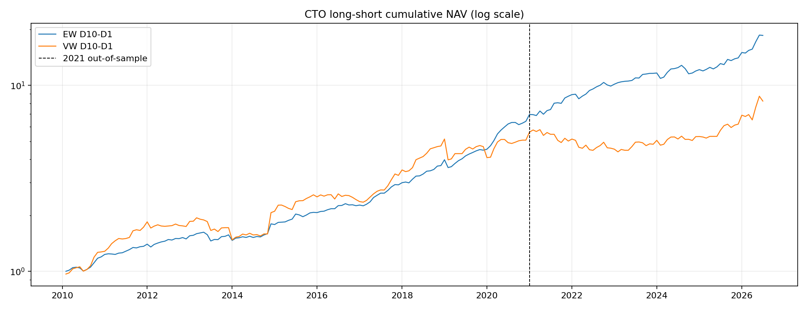
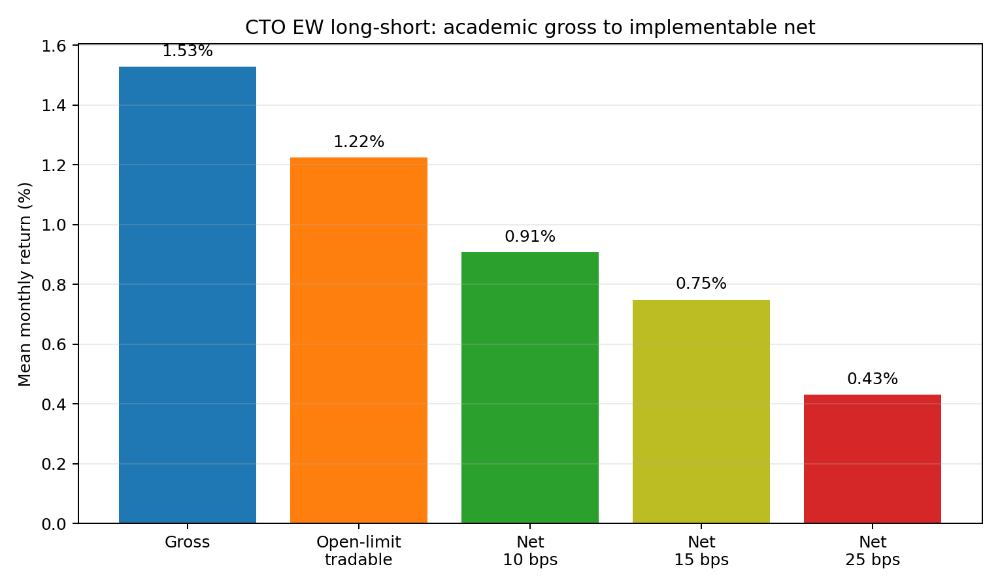
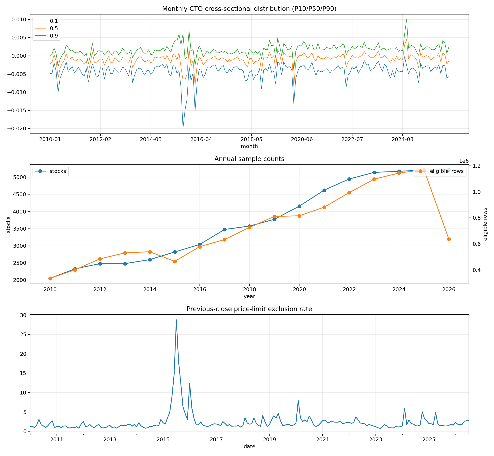

# Close-to-Open (CTO) in China A-shares

**Question and headline finding.** Does the close-to-open return identify a persistent short-term-speculation state under China’s T+1 rule? In a 2010–2026 all-A-share replication, high-CTO stocks outperform low-CTO stocks by 1.53% per month (EW); the return is concentrated in the low-CTO leg and in overnight trading, but largely disappears after realistic opening-limit and trading-cost frictions.

This repository is a research replication and extension of *Selling at the Opening: The “T+1” Rule, Short-term Speculation, and Stock Returns*. It is designed for a five-minute read of the research question and a quick verification of the included outputs. A full vendor-data rebuild is materially longer because it downloads 5,538 stock histories from free endpoints.

## Main results

### CTO long–short return (D10 − D1)

| Period | EW mean monthly return | NW(5) t | VW mean monthly return | NW(5) t |
| --- | ---: | ---: | ---: | ---: |
| Full sample, 2010–2026 | 1.53% | 7.42 | 1.25% | 3.54 |
| Paper-overlap, 2010–2020 | 1.46% | 5.88 | 1.42% | 3.25 |
| Out of sample, 2021–2026 | 1.65% | 4.47 | 0.89% | 1.56 |



### From academic return to implementable return

The paper-overlap, cost-and-tradability-adjusted EW return is only 0.25% per month (NW t=0.98) at 25 bps one-side costs. This supports the interpretation that implementation frictions can protect the apparent mispricing from arbitrage.



### Time-of-day decomposition

| Component, D10 − D1 | Full sample monthly return | NW(5) t |
| --- | ---: | ---: |
| Overnight | 3.93% | 25.82 |
| Intraday | −2.77% | −11.30 |
| Total | 1.53% | 7.42 |

The low-CTO leg loses overnight and partially recovers intraday, consistent with a persistent “speculation magnet” state rather than one isolated event. See [`results/week3/overnight_intraday_decomposition.csv`](results/week3/overnight_intraday_decomposition.csv).

### Fixed nonlinear extension

An expanding-window comparison asks whether the formation month's daily return sequence adds information beyond mean CTO, and whether that increment is nonlinear. A five-feature CTO-family Ridge raises mean IC from 0.040 to 0.077, but its out-of-sample long-short return is almost unchanged; the much larger eight-feature Ridge return is mainly associated with added size, turnover, and cumulative-return exposures. Fixed-parameter LightGBM underperforms the full Ridge (2.48% vs. 2.72% gross per month) and turns over more. See the [extension analysis](results/ml_extension/ML_EXTENSION_ANALYSIS.md).

## Data and method

- **Price source:** Baostock daily A-share history, 2010-01-01 to 2026-07-22. Post-adjusted prices construct returns; unadjusted prices perform exchange-price-limit checks. The same vendor is used for both price series.
- **Universe:** 5,538 mainland A-share codes, including delisted stocks. B shares are excluded.
- **Daily filters:** ST (`isST`), non-trading days (`tradestatus`), listing first day, first year after IPO, and observations whose prior close touched the applicable limit. The rule is 5% for ST, 10% for main board, 20% for STAR, and 10%/20% for ChiNext before/after 2020-08-24. The theoretical limit is rounded to RMB 0.01 before comparison.
- **Signal:** daily CTO is `open_t / close_(t-1) − 1`; monthly CTO is the mean eligible daily CTO in the formation month.
- **Portfolio test:** at each month end, sort stocks into CTO deciles; hold next month; report EW and float-market-cap VW returns. Long–short is D10 minus D1. Newey–West uses five lags, matching the paper.
- **Market-cap weight:** inferred float shares use `volume / turnover`, invalid `turn < 0.01%` observations are forward-filled, then shares are 20-day-median smoothed with a 5% step threshold.

## Reproduction

### Environment

```bash
python -m venv .venv
source .venv/bin/activate
pip install -r requirements.txt
python -m unittest discover -s tests -v
```

On macOS, LightGBM also needs an OpenMP runtime (for example, `brew install libomp`).

The unit tests and inspection of included `results/` complete in a few minutes. Full raw-data reconstruction is slower because free Baostock/Eastmoney endpoints are rate-limited.

### Full rebuild order

Run from the repository root. All raw/intermediate files are recreated below `data/`, which is intentionally ignored by Git.

```bash
# 1. Download post-adjusted and raw daily prices (single worker; resumable)
python src/baostock_pipeline.py

# Optional: multiple independent, resumable shards
python src/baostock_pipeline.py --shard-index 0 --shard-count 2
python src/baostock_pipeline.py --shard-index 1 --shard-count 2

# 2. Construct eligible daily/monthly CTO and diagnostics
python src/cto_pipeline.py --build-cto --source baostock

# 3. Build float market capitalization
python src/market_cap_pipeline.py

# 4. Main replication, audits, mechanism, and implementation tests
python src/run_formal_backtest.py
python src/run_week2_audits.py
python src/audit_delisting_returns.py
python src/run_week3_mechanism.py
python src/run_week3_implementation.py

# 5. Announcement extension and frozen Week-4 tests
python src/download_disclosure_events.py --start-year 2010 --end-year 2026
bash src/run_week4_label_pipeline.sh
python src/run_week4_2d_backtest.py
python src/run_week4_power_posthoc.py

# 6. Fixed eight-feature linear-versus-nonlinear extension
python src/ml_extension.py
```

Expected elapsed time: price download roughly 8–12 hours with two shards (endpoint-dependent); disclosure download roughly 1–3 hours; all local construction/backtests several hours on a modern laptop. The scripts are checkpointed where remote retrieval is involved.

## Data-quality controls



- **Cross-sectional CTO distribution / annual sample count / limit exclusion:** the diagnostic figure documents the 2015 limit-hit spike (28.78%) and the expected post-2020-08 ChiNext rule shift.
- **Timing-overlap audit:** the final formation-month CTO uses the formation-day open and prior close; the held return begins from that formation-day close, so the next-month opening return is not in the signal.
- **IPO audit:** applying the paper’s first-day-only IPO rule increases, rather than explains, the long–short result; the baseline first-year filter is retained as a documented design difference.
- **Delisting audit:** all 106 D1 holding-month delisting events remain in the return panel; removing them changes EW long–short by only 0.002 percentage points.

Supporting CSV files are in [`results/audits/`](results/audits/) and [`results/diagnostics/`](results/diagnostics/).

## Pre-registration and extension

The frozen label definition and predictions are in [`docs/WEEK4_PREREGISTERED_DESIGN.md`](docs/WEEK4_PREREGISTERED_DESIGN.md). The repository is being initialized after the research work; therefore its commit order documents the repository snapshot sequence, **not** an externally timestamped pre-registration. The design snapshot is committed before the two-dimensional result snapshot, but the original pre-Git filesystem timestamps—not Git history—are the weaker evidence that the design file preceded the results.

The resulting Q1 comparison is informative: attention-type, low-CTO stocks have a negative future return, while information-type low-CTO stocks do not. See [`docs/WEEK4_PREREGISTRATION_COMPARISON.md`](docs/WEEK4_PREREGISTRATION_COMPARISON.md).

## Limitations

- Delisting-month returns use the last available quote, not a final liquidation value.
- Float shares are inferred from turnover and can lag true share changes; quarterly balance-sheet data would remain subject to disclosure lag.
- Cost estimates are a lower bound: they do not fully model borrow availability, impact, or all short-sale constraints.
- The announcement extension omits the paper’s fourth category of “other important corporate events,” because no equivalent all-market structured AkShare feed was available.
- The strict non-limit, market-adjusted extreme-return label is sparse in the 2015 bull market: broad market gains are removed and many large jumps reached price limits. Results are therefore less representative of that environment.

## Repository layout

```text
src/       Downloaders, signal construction, backtests, audits, and extensions
tests/     Unit tests for filters, timing alignment, costs, and feature processing
docs/      Research design, audit notes, pre-registration, and result interpretation
results/   Versioned figures and compact CSV result tables; no raw daily histories
```
