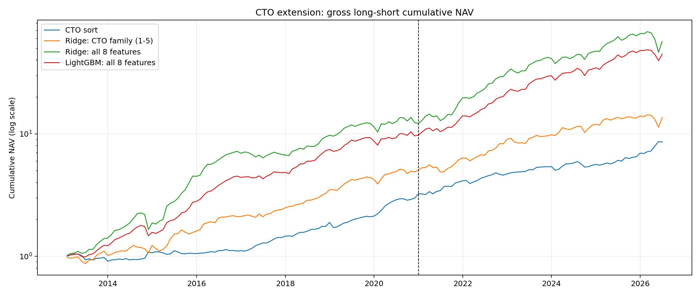
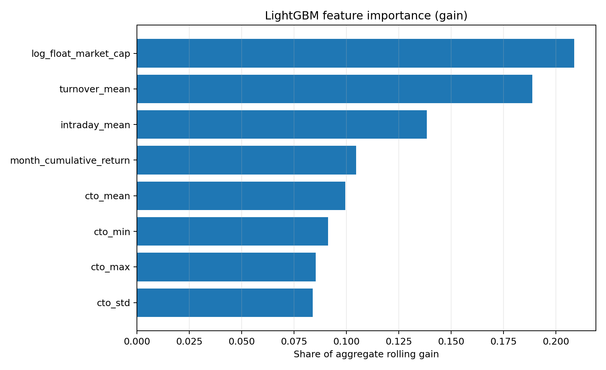
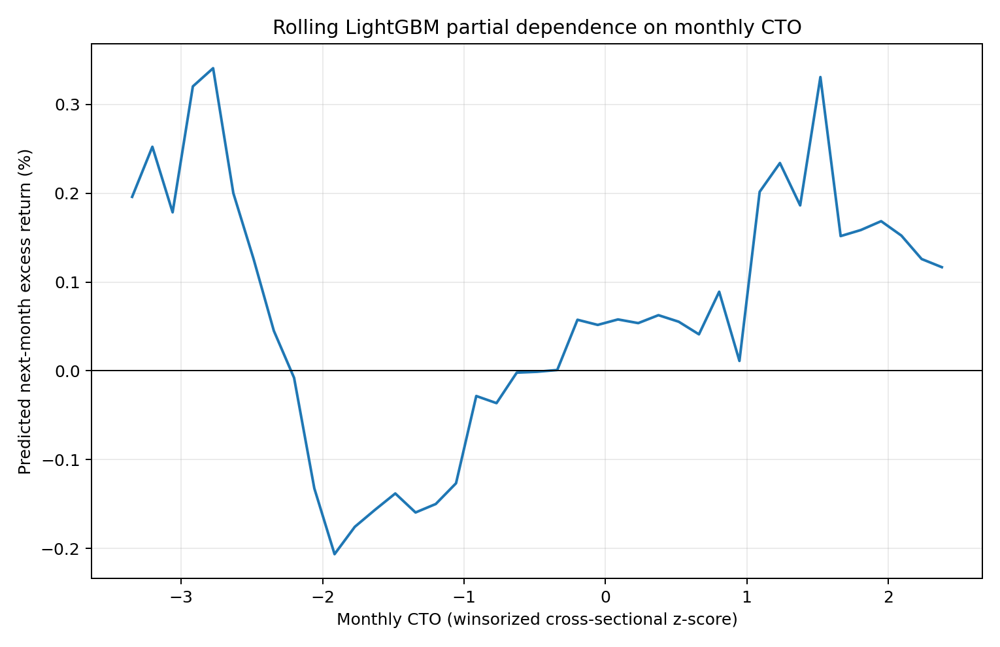

# Extension: Is CTO Predictability Linear?

## Research question and controlled comparisons

This extension asks whether CTO's predictive relation is materially nonlinear
and whether the formation month's daily return sequence contains information
beyond mean CTO. It is not a generic machine-learning exercise. Every score uses
the same main-analysis stock-months, 36-month warm-up, expanding training window,
next-month cross-sectionally demeaned target, and monthly out-of-sample predictions.

The frozen eight inputs are monthly CTO mean, CTO standard deviation/minimum/
maximum, mean intraday return, cumulative monthly return, mean turnover, and log
month-end float market capitalization. Features are winsorized at 1%/99% and
standardized within each formation-month cross-section. Four scores are compared:

1. original monthly CTO rank;
2. CTO-family Ridge using only features 1–5 (mean/distribution of CTO plus mean
   intraday return);
3. Ridge using all eight features (`alpha=1.0` for both Ridge models);
4. LightGBM using all eight features.

The added CTO-family control separates information in the daily return sequence
from the familiar size and turnover effects admitted by the full model. To avoid
in-sample tuning bias, LightGBM parameters were fixed before estimation and no
grid search was performed.

## Sample and timing audit

The main panel contains 628,701 stock-months; 627,447 (99.80%) have all eight
features, and 622,394 have both complete features and a valid next-month target.
After the fixed 36-month warm-up, predictions cover 560,090 stock-months from
formation month 2013-01 through 2026-06 (holding months 2013-02 through 2026-07).

For every monthly fit, the code asserts
`max(training holding month) <= prediction formation month < test holding month`.
The concrete Ping An Bank chronology in
[`timeline_no_overlap_example.json`](timeline_no_overlap_example.json) shows the
last training feature month (2012-12), its realized target month (2013-01), the
new formation month (2013-01), and the untouched test target (2013-02).

Because all four methods share the same warm-up and complete-case sample, the CTO
benchmark here starts in 2013 and should not numerically equal the headline
2010-start main backtest.

## Predictive results

### Monthly cross-sectional IC

ICIR is monthly mean IC divided by monthly IC standard deviation (not annualized).

| Holding-period segment | Score | Mean IC | IC standard deviation | ICIR |
| --- | --- | ---: | ---: | ---: |
| Full available | CTO rank | 0.0402 | 0.0737 | 0.546 |
| Full available | CTO-family Ridge (1–5) | 0.0774 | 0.1182 | 0.654 |
| Full available | Eight-feature Ridge | **0.1084** | 0.1467 | 0.739 |
| Full available | LightGBM | 0.0950 | 0.1245 | **0.763** |
| 2010–2020 segment (post-warm-up) | CTO rank | 0.0355 | 0.0791 | 0.449 |
| 2010–2020 segment (post-warm-up) | CTO-family Ridge (1–5) | 0.0720 | 0.1225 | 0.588 |
| 2010–2020 segment (post-warm-up) | Eight-feature Ridge | **0.1026** | 0.1481 | 0.693 |
| 2010–2020 segment (post-warm-up) | LightGBM | 0.0898 | 0.1226 | **0.733** |
| 2021–2026 | CTO rank | 0.0469 | 0.0652 | 0.719 |
| 2021–2026 | CTO-family Ridge (1–5) | 0.0850 | 0.1124 | 0.756 |
| 2021–2026 | Eight-feature Ridge | **0.1165** | 0.1453 | **0.802** |
| 2021–2026 | LightGBM | 0.1023 | 0.1278 | 0.801 |

The CTO-family score nearly doubles mean IC relative to mean CTO alone, including
out of sample. Formation-month daily return structure therefore contains genuine
incremental ranking information. But the second step—from CTO-family Ridge to the
full Ridge—adds another 0.031 mean IC. Size, turnover, and cumulative return are
material contributors, so the full model's improvement cannot be attributed to
the daily CTO distribution alone.

### Decile long-short returns and costs

| Holding-period segment | Score | Gross mean/month | NW(5) t | Net at 10 bp | Net at 15 bp | Net at 25 bp |
| --- | --- | ---: | ---: | ---: | ---: | ---: |
| Full available | CTO rank | 1.386% | 5.41 | 1.075% | 0.917% | 0.600% |
| Full available | CTO-family Ridge (1–5) | 1.737% | 5.60 | 1.433% | 1.268% | 0.939% |
| Full available | Eight-feature Ridge | **2.723%** | 5.37 | **2.508%** | **2.397%** | **2.175%** |
| Full available | LightGBM | 2.479% | **6.91** | 2.241% | 2.115% | 1.863% |
| 2010–2020 segment (post-warm-up) | CTO rank | 1.201% | 3.45 | 0.888% | 0.727% | 0.407% |
| 2010–2020 segment (post-warm-up) | CTO-family Ridge (1–5) | 1.785% | 4.28 | 1.487% | 1.317% | 0.977% |
| 2010–2020 segment (post-warm-up) | Eight-feature Ridge | **2.874%** | 4.02 | **2.659%** | **2.544%** | **2.316%** |
| 2010–2020 segment (post-warm-up) | LightGBM | 2.508% | **5.06** | 2.268% | 2.135% | 1.870% |
| 2021–2026 | CTO rank | 1.648% | 4.45 | 1.337% | 1.182% | 0.871% |
| 2021–2026 | CTO-family Ridge (1–5) | 1.670% | 3.57 | 1.356% | 1.200% | 0.887% |
| 2021–2026 | Eight-feature Ridge | **2.510%** | 3.68 | **2.297%** | **2.191%** | **1.978%** |
| 2021–2026 | LightGBM | 2.437% | **4.75** | 2.204% | 2.087% | 1.854% |

The portfolio result is sharper than the IC result. CTO-family features add 0.35
percentage points per month over CTO in the full period, but the full Ridge adds
a further 0.99 points. In 2021–2026, CTO-family Ridge and CTO rank are virtually
identical (1.67% versus 1.65%), while the full Ridge reaches 2.51%. Thus daily
return structure improves broad cross-sectional ranking, but most of the extreme-
decile return enhancement—especially out of sample—comes from the additional
style variables rather than CTO distribution shape.

Mean one-way turnover per leg is 79.1% for CTO rank, 82.2% for CTO-family Ridge,
55.5% for the full Ridge, and 63.0% for LightGBM. LightGBM remains inferior to
the full Ridge on mean IC, gross return, and turnover. Nonlinearity does not
translate into incremental out-of-sample performance.

**Cost-comparability limitation.** This section applies only the main turnover-
based 10/15/25 bp transaction-cost formula. It does not impose the main analysis's
opening-price-limit tradability screen. The 2.18% full-Ridge figure at 25 bp is
therefore not directly comparable with the 0.44% cost-and-tradability result in
the main implementation waterfall and should be interpreted as an upper bound.

## What the nonlinear model learned

Float market capitalization (20.86% of aggregate rolling gain), turnover
(18.87%), and mean intraday return (13.83%) are the largest gain contributors.
Monthly CTO is fifth at 9.93%; the CTO mean/minimum/maximum/standard-deviation
features jointly account for 35.97%. This ranking reinforces the attribution
result: the full model's headline performance mixes CTO structure with established
size and liquidity effects.

The partial-dependence curve contains local curvature, including a far-left-tail
reversal. Because LightGBM fails to beat Ridge in mean IC or portfolio returns,
this curvature is not an economically useful nonlinear signal in the frozen
test. It is also estimated while correlated CTO-distribution features are held
fixed, so sparse feature combinations make the far tail especially fragile.

## Conclusion

The controlled test yields three distinct conclusions. First, daily formation-
month return structure contains incremental ranking information beyond mean CTO.
Second, that information produces only a modest full-period long-short gain and
almost no incremental 2021–2026 extreme-decile return; the much larger full-Ridge
gain is mainly associated with the added size, turnover, and cumulative-return
variables. Third, the prespecified nonlinear model does not improve on the full
linear benchmark. The defensible result is therefore not “machine learning finds
more alpha,” but “CTO-family information exists, known style exposures explain
most portfolio enhancement, and nonlinearity adds no usable edge.”

Machine-readable results are in [`ic_summary.csv`](ic_summary.csv),
[`long_short_summary.csv`](long_short_summary.csv), and
[`portfolio_turnover_summary.csv`](portfolio_turnover_summary.csv).
